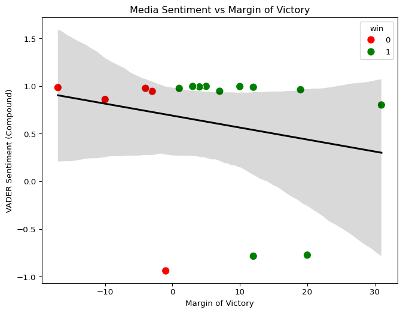
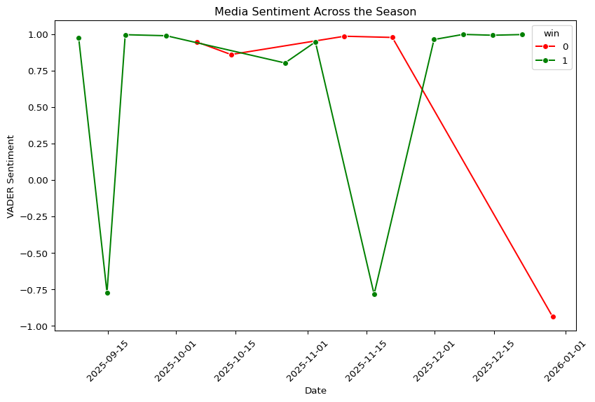
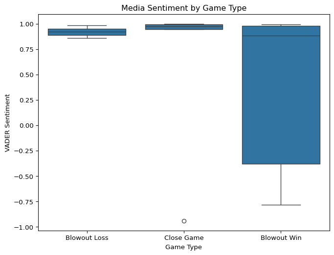

# Buffalo Bills Media Sentiment vs. Team Performance
Jack Murphy

## Project Overview

I wanted to dive in to how media sentiment differs throughout an NFL
regular season. With the NFL being a league that plays 17 regular season
games, I am interested to investigate how sentiment varies after wins
and losses, how sentiment relates to margin of victory, and the impact
win streaks has on media sentiment. The NFL has been known to be an
“overreaction” league and I believe that is best shown by the media.

To look at media sentiment, I will scrape game recap articles from the
2025-26 season about the Buffalo Bills from ESPN. The import part of
these articles will be the title, the body of text, and the date so I
can also follow the result of the game. I will compute the sentiment of
each recap and merge this with data on the game results which will be
win/loss, margin of victory, and if the team is on a win/losing streak.
With the Buffalo Bills having a star player in Josh Allen and high
expectations I expect their results to be interesting.

## Setup

``` python
import re
import time
import pandas as pd
import numpy as np
import seaborn as sns
import matplotlib.pyplot as plt
import requests
from bs4 import BeautifulSoup
from vaderSentiment.vaderSentiment import SentimentIntensityAnalyzer
analyzer = SentimentIntensityAnalyzer()
```

## Data Scraping

# Getting Bills Game IDs

``` python
team_id = 2

api_url = f"https://site.api.espn.com/apis/site/v2/sports/football/nfl/teams/{team_id}/schedule"

agents = {"User-Agent": "Mozilla/5.0"}

response = requests.get(api_url, headers=agents)
data = response.json()
data = data.get("events", [])

rows = []

for gid in data:
    game_id = gid.get("id")
    date = gid.get("date")
    matchup = gid.get("name")

    rows.append({
      "game_id": game_id,
      "date": date,
      "matchup": matchup,
      "recap_url": (f"https://www.espn.com/nfl/recap/_/gameId/{game_id}")
    })

df_games = pd.DataFrame(rows)
```

In this code, I saw in the json that the Buffalo Bills team ID was 2 so
I assigned that to them. I also created a web agent so I could scrape
smoothly. I then ran a for loop using elements in the json dictionary to
get game id, game date, and who the Bills were playing. Finally, I
assigned this into a dataframe with those elements and used the standard
structure ESPN uses to add recap urls which would help for the next step
of scraping.

# Game Recaps

``` python
def get_recap(url: str):
  r = requests.get(url, headers=agents)

  soup = BeautifulSoup(r.text, "html.parser")

    
  title_tag = soup.select_one('h1[class*="Story__Headline"]')
  title = title_tag.get_text(strip=True) if title_tag else None

  body_div = soup.select_one('div[class*="Story__Body"]')
  if body_div:
    paragraphs = body_div.find_all("p")
    article_text = " ".join(p.get_text(" ", strip=True) for p in paragraphs)
    article_text = re.sub(r"\s+", " ", article_text).strip()
  else:
    article_text = None

  return {"title": title, "article_text": article_text}

recap_rows = []

for b, row in df_games.iterrows():
  if not row["recap_url"]:
    recap_rows.append({"game_id": row["game_id"], "title": None, "article_text": None})
    continue

  rec = get_recap(row["recap_url"])
  rec["game_id"] = row["game_id"]
  recap_rows.append(rec)
  time.sleep(0.8)

df_recaps = pd.DataFrame(recap_rows)

df = df_games.merge(df_recaps, on="game_id", how="left")
```

For this code, I created a function which took the url and ran
BeautifulSoup. From there, it would extract the title and body of the
game recap. I noticed when investigating the elements of the page that
each of the elements I was looking for looked like the “div” in the
select one statement. Next, I ran a for loop using iterrows to get both
the game recap article title from the recap link and being ran through
the function. I put a if not in the for loop because I was running into
an error with some game recaps not existing, which will be cleaned in
later code.

# Game Scores

``` python
def get_bills_score(season: int, seasontype: int = 2, weeks=range(1, 19)):
  
  url = "https://site.api.espn.com/apis/site/v2/sports/football/nfl/scoreboard"

  rows = []
  
  for week in weeks:
    pars = {"dates": season, "seasontype": seasontype, "week": week}
    r = requests.get(url, headers=agents, params=pars)
    events = r.json().get("events", [])

    for ev in events:
      comp = ev["competitions"][0]
      teams = {c["team"]["displayName"]: c for c in comp["competitors"]}

      if "Buffalo Bills" not in teams:
        continue

      bills = teams["Buffalo Bills"]

      opp_name = [name for name in teams if name != "Buffalo Bills"][0]
      opp = teams[opp_name]

      b_score = int(bills["score"])
      o_score = int(opp["score"])

      rows.append({
        "game_id": str(ev["id"]),
        "week": week,
        "opponent": opp_name,
        "bills_score": b_score,
        "opp_score": o_score,
        "margin": b_score - o_score,
        "win": 1 if b_score > o_score else 0,
        "record": bills.get("records", [{}])[0].get("summary")
      })
  return pd.DataFrame(rows)

df_results = get_bills_score(season=2025, seasontype=2, weeks=range(1, 19))
df_final = df_results.merge(df, on = "game_id", how = "left")

df_final
```

<div>
<style scoped>
    .dataframe tbody tr th:only-of-type {
        vertical-align: middle;
    }
&#10;    .dataframe tbody tr th {
        vertical-align: top;
    }
&#10;    .dataframe thead th {
        text-align: right;
    }
</style>

|  | game_id | week | opponent | bills_score | opp_score | margin | win | record | date | matchup | recap_url | title | article_text |
|----|----|----|----|----|----|----|----|----|----|----|----|----|----|
| 0 | 401772918 | 1 | Baltimore Ravens | 41 | 40 | 1 | 1 | 1-0 | 2025-09-08T00:20Z | Baltimore Ravens at Buffalo Bills | https://www.espn.com/nfl/recap/\_/gameId/401772918 | Josh Allen rallies Bills for 16 points in last... | ORCHARD PARK, N.Y. -- — Josh Allen had a messa... |
| 1 | 401772727 | 2 | New York Jets | 30 | 10 | 20 | 1 | 2-0 | 2025-09-14T17:00Z | Buffalo Bills at New York Jets | https://www.espn.com/nfl/recap/\_/gameId/401772727 | Josh Allen bounces back from bloody nose, lead... | EAST RUTHERFORD, N.J. -- — Josh Allen 's nose ... |
| 2 | 401772937 | 3 | Miami Dolphins | 31 | 21 | 10 | 1 | 3-0 | 2025-09-19T00:15Z | Miami Dolphins at Buffalo Bills | https://www.espn.com/nfl/recap/\_/gameId/401772937 | Josh Allen's 3 TD passes and Terrel Bernard's ... | ORCHARD PARK, N.Y. -- — Buffalo Bills lineback... |
| 3 | 401772740 | 4 | New Orleans Saints | 31 | 19 | 12 | 1 | 4-0 | 2025-09-28T17:00Z | New Orleans Saints at Buffalo Bills | https://www.espn.com/nfl/recap/\_/gameId/401772740 | Josh Allen combines for 3 TDs and Bills improv... | ORCHARD PARK, N.Y. -- — With the outcome still... |
| 4 | 401772922 | 5 | New England Patriots | 20 | 23 | -3 | 0 | 4-1 | 2025-10-06T00:20Z | New England Patriots at Buffalo Bills | https://www.espn.com/nfl/recap/\_/gameId/401772922 | Drake Maye leads Patriots to 23-20 win over Bi... | ORCHARD PARK, N.Y. -- — Receiver Stefon Diggs ... |
| 5 | 401772815 | 6 | Atlanta Falcons | 14 | 24 | -10 | 0 | 4-2 | 2025-10-13T23:15Z | Buffalo Bills at Atlanta Falcons | https://www.espn.com/nfl/recap/\_/gameId/401772815 | Falcons ride Robinson's 170 rushing yards, inc... | ATLANTA -- — Big plays from Bijan Robinson and... |
| 6 | 401772865 | 8 | Carolina Panthers | 40 | 9 | 31 | 1 | 5-2 | 2025-10-26T17:00Z | Buffalo Bills at Carolina Panthers | https://www.espn.com/nfl/recap/\_/gameId/401772865 | James Cook runs for 216 yards and 2 TDs, Allen... | CHARLOTTE, N.C. -- — A little rest proved just... |
| 7 | 401772768 | 9 | Kansas City Chiefs | 28 | 21 | 7 | 1 | 6-2 | 2025-11-02T21:25Z | Kansas City Chiefs at Buffalo Bills | https://www.espn.com/nfl/recap/\_/gameId/401772768 | Allen has 3 TDs and Bills use sturdy defense t... | ORCHARD PARK, N.Y. -- — After Josh Allen spent... |
| 8 | 401772771 | 10 | Miami Dolphins | 13 | 30 | -17 | 0 | 6-3 | 2025-11-09T18:00Z | Buffalo Bills at Miami Dolphins | https://www.espn.com/nfl/recap/\_/gameId/401772771 | Dolphins end seven-game losing streak against ... | MIAMI GARDENS, Fla. -- — Tua Tagovailoa had on... |
| 9 | 401772776 | 11 | Tampa Bay Buccaneers | 44 | 32 | 12 | 1 | 7-3 | 2025-11-16T18:00Z | Tampa Bay Buccaneers at Buffalo Bills | https://www.espn.com/nfl/recap/\_/gameId/401772776 | Josh Allen has 3 TDs passing, 3 rushing to out... | ORCHARD PARK, N.Y. -- — Josh Allen wasn't in a... |
| 10 | 401772946 | 12 | Houston Texans | 19 | 23 | -4 | 0 | 7-4 | 2025-11-21T01:15Z | Buffalo Bills at Houston Texans | https://www.espn.com/nfl/recap/\_/gameId/401772946 | Texans get 8 sacks and Bullock forces 3 turnov... | HOUSTON -- — Buffalo's Josh Allen was harassed... |
| 11 | 401772789 | 13 | Pittsburgh Steelers | 26 | 7 | 19 | 1 | 8-4 | 2025-11-30T21:25Z | Buffalo Bills at Pittsburgh Steelers | https://www.espn.com/nfl/recap/\_/gameId/401772789 | Josh Allen sets career mark for rushing TDs by... | PITTSBURGH -- — Josh Allen and the Buffalo Bil... |
| 12 | 401772902 | 14 | Cincinnati Bengals | 39 | 34 | 5 | 1 | 9-4 | 2025-12-07T18:00Z | Cincinnati Bengals at Buffalo Bills | https://www.espn.com/nfl/recap/\_/gameId/401772902 | Bills rally for 39-34 win over Bengals thanks ... | ORCHARD PARK, N.Y. -- — Christian Benford apol... |
| 13 | 401772795 | 15 | New England Patriots | 35 | 31 | 4 | 1 | 10-4 | 2025-12-14T18:00Z | Buffalo Bills at New England Patriots | https://www.espn.com/nfl/recap/\_/gameId/401772795 | Bills rally from 21-point deficit to beat Patr... | FOXBOROUGH, Mass. -- — The New England Patriot... |
| 14 | 401772802 | 16 | Cleveland Browns | 23 | 20 | 3 | 1 | 11-4 | 2025-12-21T18:00Z | Buffalo Bills at Cleveland Browns | https://www.espn.com/nfl/recap/\_/gameId/401772802 | Cook's 117-yard, 2-TD performance propels Bill... | CLEVELAND -- — James Cook continues to show op... |
| 15 | 401772917 | 17 | Philadelphia Eagles | 12 | 13 | -1 | 0 | 11-5 | 2025-12-28T21:25Z | Philadelphia Eagles at Buffalo Bills | https://www.espn.com/nfl/recap/\_/gameId/401772917 | Eagles hang on to beat Bills 13-12 when Josh A... | ORCHARD PARK, N.Y. -- — As Jalen Carter and hi... |
| 16 | 401772967 | 18 | New York Jets | 35 | 8 | 27 | 1 | 12-5 | 2026-01-04T21:25Z | New York Jets at Buffalo Bills | https://www.espn.com/nfl/recap/\_/gameId/401772967 | None | None |

</div>

For this, I was able to find an API for ESPN for final scores. In this
code, I created a function where it would get the json events. It would
then for loop through the json looking for the Bills and the opponent
(by finding the team who was not Buffalo in the event). It would then
get the integer for both the Bills and opponent score. If the Bills
score was greater than opponent it would then assign a “1” which means
win in the Dataframe. Next, I got the Bills record after the completion
of the game. Finally, I was able to do multiple calls in the range of
weeks 1-19, merge them together to create the desired dataframe for my
analysis.

# Cleaning The Dataframe

``` python
df_final['date'] = df_final['date'].astype(str)

df_final['date'] = df_final['date'].str.extract(r'^(.{10})')

df_final['date'] = pd.to_datetime(df['date'])

df_final = df_final.drop(16, axis = 0)

df_final
```

<div>
<style scoped>
    .dataframe tbody tr th:only-of-type {
        vertical-align: middle;
    }
&#10;    .dataframe tbody tr th {
        vertical-align: top;
    }
&#10;    .dataframe thead th {
        text-align: right;
    }
</style>

|  | game_id | week | opponent | bills_score | opp_score | margin | win | record | date | matchup | recap_url | title | article_text |
|----|----|----|----|----|----|----|----|----|----|----|----|----|----|
| 0 | 401772918 | 1 | Baltimore Ravens | 41 | 40 | 1 | 1 | 1-0 | 2025-09-08 00:20:00+00:00 | Baltimore Ravens at Buffalo Bills | https://www.espn.com/nfl/recap/\_/gameId/401772918 | Josh Allen rallies Bills for 16 points in last... | ORCHARD PARK, N.Y. -- — Josh Allen had a messa... |
| 1 | 401772727 | 2 | New York Jets | 30 | 10 | 20 | 1 | 2-0 | 2025-09-14 17:00:00+00:00 | Buffalo Bills at New York Jets | https://www.espn.com/nfl/recap/\_/gameId/401772727 | Josh Allen bounces back from bloody nose, lead... | EAST RUTHERFORD, N.J. -- — Josh Allen 's nose ... |
| 2 | 401772937 | 3 | Miami Dolphins | 31 | 21 | 10 | 1 | 3-0 | 2025-09-19 00:15:00+00:00 | Miami Dolphins at Buffalo Bills | https://www.espn.com/nfl/recap/\_/gameId/401772937 | Josh Allen's 3 TD passes and Terrel Bernard's ... | ORCHARD PARK, N.Y. -- — Buffalo Bills lineback... |
| 3 | 401772740 | 4 | New Orleans Saints | 31 | 19 | 12 | 1 | 4-0 | 2025-09-28 17:00:00+00:00 | New Orleans Saints at Buffalo Bills | https://www.espn.com/nfl/recap/\_/gameId/401772740 | Josh Allen combines for 3 TDs and Bills improv... | ORCHARD PARK, N.Y. -- — With the outcome still... |
| 4 | 401772922 | 5 | New England Patriots | 20 | 23 | -3 | 0 | 4-1 | 2025-10-06 00:20:00+00:00 | New England Patriots at Buffalo Bills | https://www.espn.com/nfl/recap/\_/gameId/401772922 | Drake Maye leads Patriots to 23-20 win over Bi... | ORCHARD PARK, N.Y. -- — Receiver Stefon Diggs ... |
| 5 | 401772815 | 6 | Atlanta Falcons | 14 | 24 | -10 | 0 | 4-2 | 2025-10-13 23:15:00+00:00 | Buffalo Bills at Atlanta Falcons | https://www.espn.com/nfl/recap/\_/gameId/401772815 | Falcons ride Robinson's 170 rushing yards, inc... | ATLANTA -- — Big plays from Bijan Robinson and... |
| 6 | 401772865 | 8 | Carolina Panthers | 40 | 9 | 31 | 1 | 5-2 | 2025-10-26 17:00:00+00:00 | Buffalo Bills at Carolina Panthers | https://www.espn.com/nfl/recap/\_/gameId/401772865 | James Cook runs for 216 yards and 2 TDs, Allen... | CHARLOTTE, N.C. -- — A little rest proved just... |
| 7 | 401772768 | 9 | Kansas City Chiefs | 28 | 21 | 7 | 1 | 6-2 | 2025-11-02 21:25:00+00:00 | Kansas City Chiefs at Buffalo Bills | https://www.espn.com/nfl/recap/\_/gameId/401772768 | Allen has 3 TDs and Bills use sturdy defense t... | ORCHARD PARK, N.Y. -- — After Josh Allen spent... |
| 8 | 401772771 | 10 | Miami Dolphins | 13 | 30 | -17 | 0 | 6-3 | 2025-11-09 18:00:00+00:00 | Buffalo Bills at Miami Dolphins | https://www.espn.com/nfl/recap/\_/gameId/401772771 | Dolphins end seven-game losing streak against ... | MIAMI GARDENS, Fla. -- — Tua Tagovailoa had on... |
| 9 | 401772776 | 11 | Tampa Bay Buccaneers | 44 | 32 | 12 | 1 | 7-3 | 2025-11-16 18:00:00+00:00 | Tampa Bay Buccaneers at Buffalo Bills | https://www.espn.com/nfl/recap/\_/gameId/401772776 | Josh Allen has 3 TDs passing, 3 rushing to out... | ORCHARD PARK, N.Y. -- — Josh Allen wasn't in a... |
| 10 | 401772946 | 12 | Houston Texans | 19 | 23 | -4 | 0 | 7-4 | 2025-11-21 01:15:00+00:00 | Buffalo Bills at Houston Texans | https://www.espn.com/nfl/recap/\_/gameId/401772946 | Texans get 8 sacks and Bullock forces 3 turnov... | HOUSTON -- — Buffalo's Josh Allen was harassed... |
| 11 | 401772789 | 13 | Pittsburgh Steelers | 26 | 7 | 19 | 1 | 8-4 | 2025-11-30 21:25:00+00:00 | Buffalo Bills at Pittsburgh Steelers | https://www.espn.com/nfl/recap/\_/gameId/401772789 | Josh Allen sets career mark for rushing TDs by... | PITTSBURGH -- — Josh Allen and the Buffalo Bil... |
| 12 | 401772902 | 14 | Cincinnati Bengals | 39 | 34 | 5 | 1 | 9-4 | 2025-12-07 18:00:00+00:00 | Cincinnati Bengals at Buffalo Bills | https://www.espn.com/nfl/recap/\_/gameId/401772902 | Bills rally for 39-34 win over Bengals thanks ... | ORCHARD PARK, N.Y. -- — Christian Benford apol... |
| 13 | 401772795 | 15 | New England Patriots | 35 | 31 | 4 | 1 | 10-4 | 2025-12-14 18:00:00+00:00 | Buffalo Bills at New England Patriots | https://www.espn.com/nfl/recap/\_/gameId/401772795 | Bills rally from 21-point deficit to beat Patr... | FOXBOROUGH, Mass. -- — The New England Patriot... |
| 14 | 401772802 | 16 | Cleveland Browns | 23 | 20 | 3 | 1 | 11-4 | 2025-12-21 18:00:00+00:00 | Buffalo Bills at Cleveland Browns | https://www.espn.com/nfl/recap/\_/gameId/401772802 | Cook's 117-yard, 2-TD performance propels Bill... | CLEVELAND -- — James Cook continues to show op... |
| 15 | 401772917 | 17 | Philadelphia Eagles | 12 | 13 | -1 | 0 | 11-5 | 2025-12-28 21:25:00+00:00 | Philadelphia Eagles at Buffalo Bills | https://www.espn.com/nfl/recap/\_/gameId/401772917 | Eagles hang on to beat Bills 13-12 when Josh A... | ORCHARD PARK, N.Y. -- — As Jalen Carter and hi... |

</div>

Here I fixed the format of date to look better without the time. I also
removed the Bills game against Jets because no game recap exists on
ESPN. This is likely because it was the last game of the season and the
Bills did not play key players.

## Sentiment Analysis

``` python
df_final["title_sentiment"] = df_final["title"].apply(
  lambda x: analyzer.polarity_scores(str(x))["compound"]
)

df_final["article_sentiment"] = df_final["article_text"].apply(
  lambda x: analyzer.polarity_scores(str(x))["compound"]
)

df_final["article_sentiment"].describe()
```

    count    16.000000
    mean      0.619969
    std       0.723483
    min      -0.939200
    25%       0.844750
    50%       0.968900
    75%       0.988950
    max       0.997200
    Name: article_sentiment, dtype: float64

I ran a Vader Sentiment Analysis here because I was looking for positive
/ negative sentiment from the media. I thought this would be the best
one to run.

## Analysis

# Comparing Wins vs. Loses

``` python
df_final.groupby("win")["article_sentiment"].mean()
```

    win
    0    0.565100
    1    0.644909
    Name: article_sentiment, dtype: float64

This shows the difference in sentiment scores in wins and losses. As
shown it is similar with wins being slightly more positive in sentiment.
\# Sentiment vs. Margin

``` python
plt.figure(figsize=(8,6))

sns.scatterplot(
    x="margin",
    y="article_sentiment",
    hue="win",
    palette={1: "green", 0: "red"},
    data=df_final,
    s=100
)

sns.regplot(
    x="margin",
    y="article_sentiment",
    scatter=False,
    color="black",
    data=df_final
)

plt.title("Media Sentiment vs Margin of Victory")
plt.xlabel("Margin of Victory")
plt.ylabel("VADER Sentiment (Compound)")
plt.show()
```



This graph shows that overall media sentiment stays pretty positive
about games no matter how much the margin of victory is. Typically,
sentiment stays around 1 except in a couple outlier games. Even in Bills
large wins the negative sentiments were likely about the other team
rather than the Bills. \# Sentiment Over the Season

``` python
df_final = df_final.sort_values("date")

plt.figure(figsize=(10,6))

sns.lineplot(
    x="date",
    y="article_sentiment",
    hue="win",
    palette={1: "green", 0: "red"},
    marker="o",
    data=df_final
)

plt.title("Media Sentiment Across the Season")
plt.xlabel("Date")
plt.ylabel("VADER Sentiment")
plt.xticks(rotation=45)
plt.show()
```



This visualization again shows that sentiment stays pretty neutral
throughout the season. I was interested in this because the Bills had a
losing streak of two games which is where I thought there would be
biggest margin in vader sentiment score. Overall other than a couple
outliers the media did a great job in staying neutral throughout the
year in their coverage of Buffalo’s game recaps.

# Close Games vs. Blowouts

``` python
df_final["game_type"] = pd.cut(
    df_final["margin"],
    bins=[-40, -7, 7, 40],
    labels=["Blowout Loss", "Close Game", "Blowout Win"]
)
```

``` python
plt.figure(figsize=(8,6))

sns.boxplot(
    x="game_type",
    y="article_sentiment",
    data=df_final
)

plt.title("Media Sentiment by Game Type")
plt.xlabel("Game Type")
plt.ylabel("VADER Sentiment")
plt.show()
```



I wanted to see boxplots of the difference in certain game scores. If
the Bills lost by more than 7, the score was between 7 points, and when
the Bills won by more than 7. As shown, the Bills had more blowout wins
so there was greater spread in that boxplot. The trend of being
consistent stayed true here.

## Conclusion and Findings

Based on the analysis, overall ESPN game recaps are positive no matter
the result of the game. There were minor differences in scores based on
if the Bills won or lost as wins were around .08 higher in positivity.
This went against my expectations going into the project because I
believed that there would be a major difference between the two scores
based on previous experience of people reacting to game results.

I also believe that since the Bills made the playoffs and their record
was reflective of expectations that sentiment was not as negative after
losses. Losses still had a more negative sentiment which made sense, but
since the Bills didn’t lose games by a huge margin except for the game
against the Dolphins there was not enough of a sample size to truly see.

In the future, I would be interested to run this experiment with other
teams to see if there were any differences in results. Overall, the
professional media was balanced but there were minor differences
depending on game result which could likely be noticed when reading the
actual game recaps.
